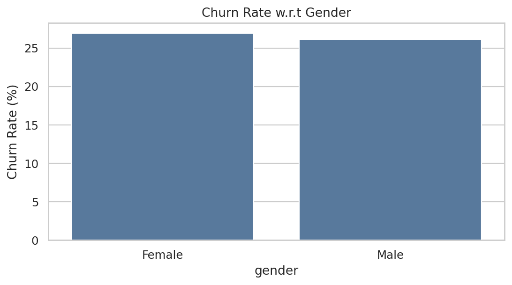
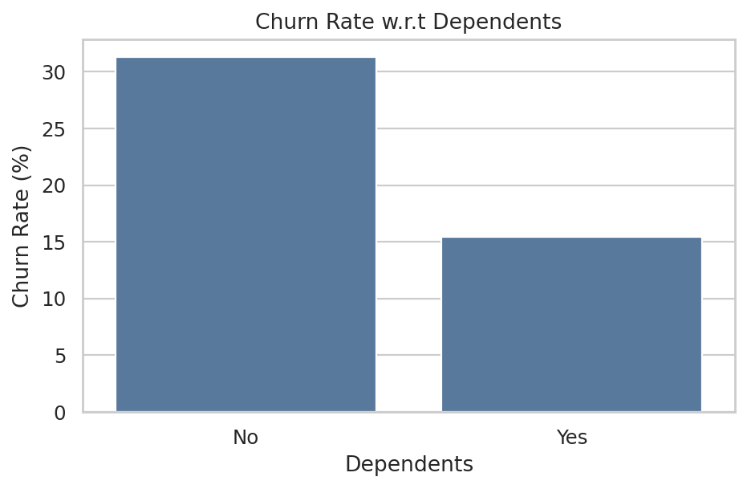
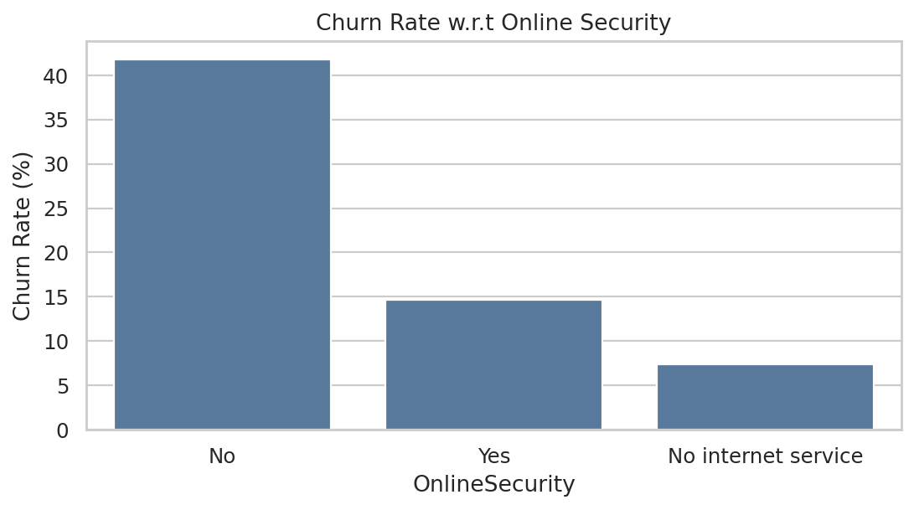
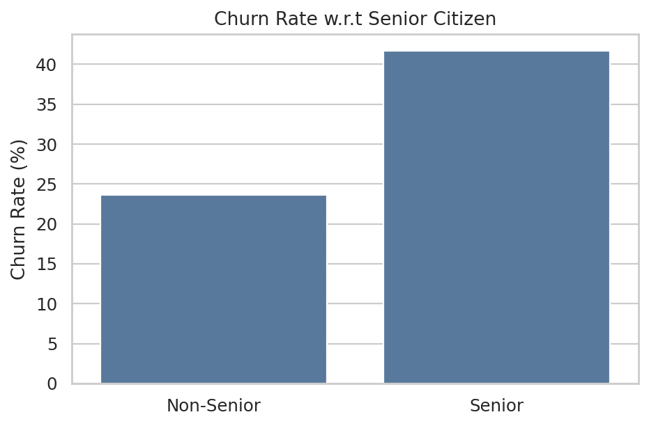
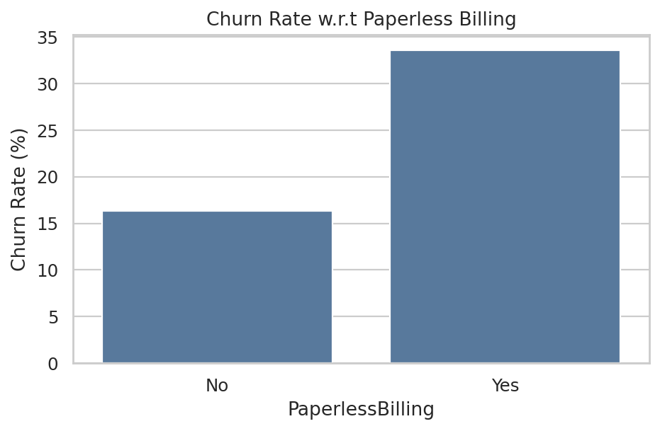
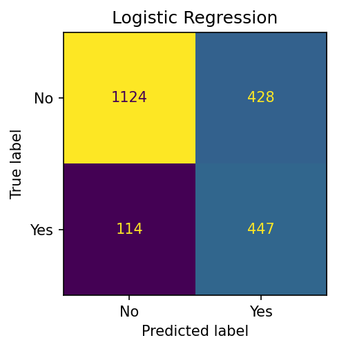
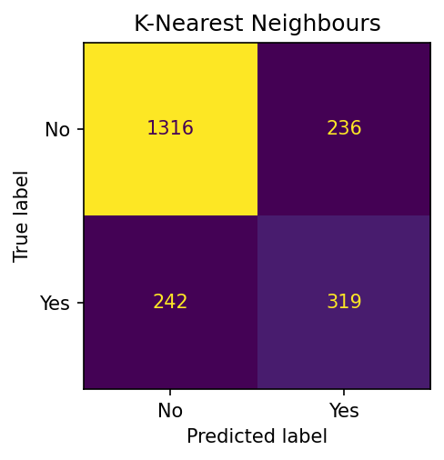
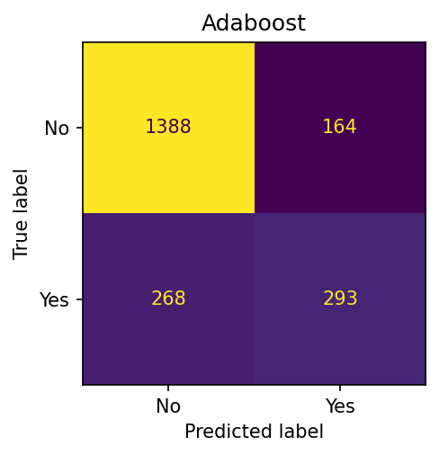

<div align="right">

[1]: https://github.com/AadityaChaudhary-git
[2]: https://www.linkedin.com/in/aaditya-chaudhary-3a322b329/


[][1]
[][2]

</div>


# <div align="center">Telecom Customer Churn Prediction</div>


## What is Customer Churn?
Customer churn is defined as when customers or subscribers discontinue doing business with a firm or service.

Customers in the telecom industry can choose from a variety of service providers and actively switch from one to the next. Understanding customer churn is therefore important for a telecom company because retaining existing customers can be more cost-effective than acquiring new customers.

Individualized customer retention is difficult because most firms have a large number of customers and cannot afford to devote equal attention to every customer. However, if a company could forecast which customers are likely to leave ahead of time, it could focus customer retention efforts only on these "high risk" clients.

The goal of this project is to understand the major churn drivers, analyse customer segments using SQL and exploratory data analysis, and build machine learning models that can classify churn and non-churn customers.

Customer churn is a critical metric because losing customers affects recurring revenue, customer lifetime value and long-term business growth.

To detect early signs of potential churn, one must first develop a holistic view of the customers and their interactions across numerous services and account attributes. By analysing these patterns, businesses can focus retention strategies on the customers and segments that need attention most.


## Objectives:
- Finding the percentage of Churn Customers and customers that remain with the active services.
- Analysing the data in terms of various features associated with customer Churn.
- Analysing customer segments using SQL and exploratory data analysis.
- Finding the most suitable machine learning model for classification of Churn and non-churn customers.
- Comparing multiple machine learning algorithms using cross-validation and test-set metrics.
- Identifying important customer characteristics associated with higher churn risk.


## Dataset:

The project uses the **IBM Telco Customer Churn dataset**, which contains customer demographic information, subscribed services and account information.

### The data set includes information about:

- Customers who left within the last month – the column is called `Churn`
- Services that each customer has signed up for – phone, multiple lines, internet, online security, online backup, device protection, tech support, streaming TV and movies
- Customer account information – how long they’ve been a customer, contract, payment method, paperless billing, monthly charges, and total charges
- Demographic information about customers – gender, senior citizen status, partners and dependents

The dataset contains **7,043 customer records and 21 columns**.

## Implementation:

**Libraries:** sklearn, Matplotlib, pandas, seaborn, NumPy, SQLite

**Technologies:** Python, SQL and Machine Learning


## Few glimpses of EDA:

### 1. Churn distribution:

> 

> **26.54% of customers churned.**


### 2. Churn distribution with respect to gender:

> 

> There is a relatively small difference in churn rate between male and female customers. Gender is therefore not one of the strongest churn indicators in this dataset.


### 3. Customer Contract distribution:

> 

> About **42.71% of customers with Month-to-Month Contract churned**, compared with approximately **11.27% of customers with One Year Contract** and **2.83% with Two Year Contract**.

> Contract type is one of the strongest churn-related variables in this dataset, with month-to-month customers showing substantially higher churn.


### 4. Payment Methods:

> 

> 

> Customers using **Electronic Check** have a churn rate of approximately **45.29%**, while customers using automatic credit-card and bank-transfer payment methods have substantially lower churn rates.

> Payment method can therefore be useful when identifying higher-risk customer segments.


### 5. Internet services:

> 

> **Fiber optic** customers show a high churn rate of approximately **41.89%**, while **DSL** customers have a churn rate of approximately **18.96%**.

> Customers without internet service have a much lower churn rate of approximately **7.40%**.


### 6. Dependent distribution:

> 

> Customers without dependents are more likely to churn than customers with dependents in this dataset.


### 7. Online Security:

> 

> Customers without Online Security have a higher churn rate than customers who have the service.


### 8. Senior Citizen:

> 

> Senior citizens have a higher churn rate than non-senior customers, although they represent a smaller part of the overall customer base.


### 9. Paperless Billing:

> 

> Customers with Paperless Billing have a higher churn rate in this dataset.


### 10. Tech support:

> 

> Customers with no TechSupport have a higher churn rate than customers who have TechSupport.


### 11. Distribution w.r.t Charges and Tenure:

> 

> 

> 

> Customers with higher Monthly Charges are more likely to churn.

> New customers are more likely to churn. Churned customers have an average tenure of approximately **18 months**, compared with approximately **38 months** for retained customers.

> This suggests that the early stage of the customer lifecycle is an important period for retention efforts.


## Machine Learning Model Evaluations and Predictions:


The project evaluates multiple supervised classification algorithms for predicting customer churn.

The models evaluated include:

- Logistic Regression
- Linear SVM
- Kernel SVM
- K-Nearest Neighbours
- Naive Bayes
- Decision Tree
- Random Forest
- AdaBoost
- Gradient Boost
- Voting Classifier


#### Results after K fold cross validation:









### Model Comparison:

The models were evaluated using cross-validation and a stratified test set.

The evaluation metrics include:

- Accuracy
- Precision
- Recall
- F1-score
- ROC-AUC

Complete model comparison results are available in:

```text
output/model_results.csv
