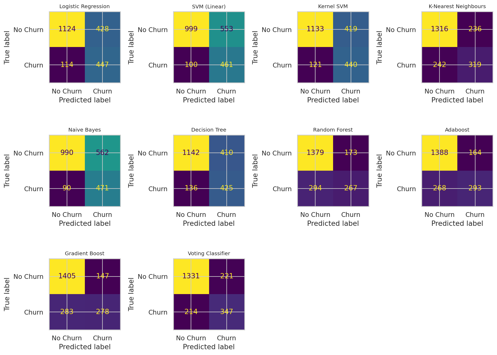

<div align="right">

[1]: YOUR_GITHUB_LINK
[2]: YOUR_LINKEDIN_LINK


[][1]
[][2]

</div>


# <div align="center">Telecom Customer Churn Prediction</div>


## What is Customer Churn?
Customer churn is defined as when customers or subscribers discontinue doing business with a firm or service.

Customers in the telecom industry can choose from a variety of service providers and actively switch from one to the next. Understanding customer churn is therefore important for a telecom company because retaining existing customers can be more cost-effective than acquiring new customers.

Individualized customer retention is tough because most firms have a large number of customers and can't afford to devote much time to each of them. However, if a corporation could forecast which customers are likely to leave ahead of time, it could focus customer retention efforts only on these "high risk" clients. The goal of this project is to understand the major churn drivers and build machine learning models that can classify churn and non-churn customers.

Customer churn is a critical metric because losing customers affects recurring revenue, customer lifetime value and long-term business growth.

To detect early signs of potential churn, one must first develop a holistic view of the customers and their interactions across numerous services and account attributes. As a result, by addressing churn, businesses can focus retention strategies on the customers and segments that need attention most.

## Objectives:
- Finding the % of Churn Customers and customers that keep in with the active services.
- Analysing the data in terms of various features responsible for customer Churn.
- Analysing customer segments using SQL and exploratory data analysis.
- Finding a most suited machine learning model for correct classification of Churn and non churn customers.
- Comparing multiple machine learning algorithms using cross-validation and test-set metrics.

## Dataset:
 [Telco Customer Churn](https://www.kaggle.com/bhartiprasad17/customer-churn-prediction/data)

### The data set includes information about:

- Customers who left within the last month – the column is called Churn
- Services that each customer has signed up for – phone, multiple lines, internet, online security, online backup, device protection, tech support, and streaming TV and movies
- Customer account information – how long they’ve been a customer, contract, payment method, paperless billing, monthly charges, and total charges
- Demographic info about customers – gender, age range, and if they have partners and dependents
## Implementation:

**Libraries:** sklearn, Matplotlib, pandas, seaborn, NumPy, SQLite


## Few glimpses of EDA:
### 1. Churn distribution:

> 
> 26.54 % of customers churned.

### 2. Churn distribution with respect to gender:
> 


> There is a relatively small difference in churn rate between male and female customers. Gender is therefore not one of the strongest churn indicators in this dataset.

### 3. Customer Contract distribution:
> 
> About 42.71% of customers with Month-to-Month Contract churned as compared to 11.27% of customers with One Year Contract and 2.83% with Two Year Contract.

### 4. Payment Methods:
>  

> Major customers who churned were associated with Electronic Check as Payment Method.
> Electronic Check customers have a churn rate of approximately 45.29%, while Credit-Card automatic transfer and Bank Automatic Transfer customers have substantially lower churn rates.

### 5. Internet services:

> Fiber optic customers show a high churn rate of approximately 41.89%, while DSL customers have a churn rate of approximately 18.96%.
> Customers without internet service have a much lower churn rate of approximately 7.40%.


### 6. Dependent distribution:

> Customers without dependents are more likely to churn.


### 7. Online Security:

> Customers without Online Security have a higher churn rate than customers who have the service.


### 8. Senior Citizen:

> Senior citizens have a higher churn rate than non-senior customers, although they represent a smaller part of the overall customer base.


### 9. Paperless Billing:

> Customers with Paperless Billing have a higher churn rate in this dataset.


### 10. Tech support:

> Customers with no TechSupport have a higher churn rate than customers who have TechSupport.


### 11. Distribution w.r.t Charges and Tenure:
> 
> 
> 

> Customers with higher Monthly Charges are also more likely to churn.
> New customers are more likely to churn. Churned customers have an average tenure of about 18 months compared with about 38 months for retained customers.

## Machine Learning Model Evaluations and Predictions:


#### Results after K fold cross validation:

 




#### Final Model: Selected from model comparison
* The final model is selected using cross-validated ROC-AUC together with test-set performance. The project also includes a soft Voting Classifier combining Gradient Boosting, Random Forest and Logistic Regression.

```python
from sklearn.ensemble import VotingClassifier

eclf1 = VotingClassifier(
    estimators=[
        ('gbc', GradientBoostingClassifier(random_state=42)),
        ('rf', RandomForestClassifier(n_estimators=150, random_state=42)),
        ('lr', LogisticRegression(max_iter=1500, random_state=42))
    ],
    voting='soft'
)
```

```text
Model comparison, cross-validation scores and test-set metrics
are available in output/model_results.csv.
```


> The confusion matrices show true negatives, false positives, false negatives and true positives for the evaluated classification models. The exact values are generated from the current stratified train/test split.

## Optimizations

We could use Hyperparameter Tuning, Feature Engineering, threshold optimization and model explainability methods to improve the model further.


### Feedback

If you have any feedback, please reach out through the GitHub or LinkedIn links above.


### 🚀 About Me
#### Hi, I'm Your Name! 👋
I am an MCA AI & Data Science student and an aspiring Data Analyst and Machine Learning practitioner.


[1]: YOUR_GITHUB_LINK
[2]: YOUR_LINKEDIN_LINK


[][1]
[][2]
